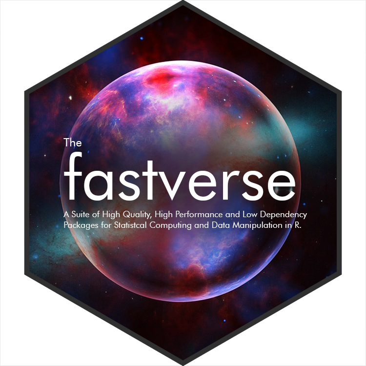

# fastverse 

<!-- badges: start 
[](https://cran.r-project.org/package=fastverse) 
[](https://cran.r-project.org/web/checks/check_results_fastverse.html)
[](https://travis-ci.com/SebKrantz/fastverse)
[](https://codecov.io/gh/SebKrantz/fastverse?branch=master)
[](https://cran.r-project.org/)
[](https://CRAN.R-project.org/package=fastverse)
[](https://www.fastverse.org/lifecycle/#maturing)


 badges: end -->


The *fastverse* package integrates and provides utilities for easy installation, loading and management of a complimentary set of high-performance R packages for statistical computing and data manipulation. *fastverse* packages work well together and provide:

- Fast R code - especially for limited personal computing resources. All critical codes in *fastverse* packages are written in a compiled language such as C, C++ or Fortran. Many packages additionally offer multi-threading. 

- High code quality and above average levels of maintenance, thorough documentation and seamless application to the designated R objects, minding all the typical properties of real world data such as missing values. 

- A minimal set of dependencies. Most *fastverse* packages only depend on packages providing C++ API's in R, if any. 

## Packages

The *fastverse* consists of 6 core packages (7 dependencies in total) that provide broad based data manipulation functionality and have a carefully managed API. These packages are installed and attached along with the `fastverse` package. In addition the user has the option (via the `fastverse_entend()` function) to freely and flexibly install and attach extension packages offering more specific functionality. 

### Core fastverse

- **data.table**: Enhanced data frame class with concise data manipulation framework offering powerful aggregation, extremely flexible split-apply-combine computing, reshaping, joins, rolling statistics, set operations on tables, fast csv read/write, and various utilities such as transposition of data. 

- **collapse**: Fast grouped & weighted statistical computations, time series and panel data transformations, list-processing, data manipulation functions, summary statistics and various utilities such as support for variable labels. Class-agnostic framework designed to work with vectors, matrices, data frames and related classes including *xts*, *data.table*, *tibble*, *pdata.frame*, *sf*.  <!-- *tsibble*, *tibbletime* -->

- **matrixStats**: Efficient row-and column-wise statistics on matrices (and vectors), including computations on subsets of rows and columns. 

- **kit**: Fast vectorized and nested switches, some parallel (row-wise) statistics, and some utilities such as efficient partial sorting and unique values. 

- **magrittr**: Efficient pipe operators for enhanced programming and code unnesting.

- **fst**: A compressed data file format that is very fast to read and write. 

  *Additional dependency*: Package *Rcpp* is imported by *collapse* and *fst*.

### Extended fastverse


#### Time Series
- **xts** and **zoo**: A fast and reliable matrix-based time series class providing fully identified ordered observations and various utilities for plotting and computations.

- **roll**: Really fast rolling and expanding window functions that preserve *xts*.

  *Integration Notes*: *xts* objects are preserved by *roll* functions and by *collapse*'s fast time series and data transformation functions. Passing the `xts::index()` coerced to integer to the `t` argument of *collapse*'s `flag`, `fdiff` and `fgrowth` further allows exact time-based computations on irregularly spaced time series, which is not supported by *xts*'s built-in functions. As *xts* objects are matrices, all *matrixStats* functions apply to them as well. Finally, *xts* objects can be converted quickly and easily to and from *data.table*. 

#### Dates and Times 
- **lubridate**: Comprehensive and fast library to deal with dates and times.

- **clock**: Comprehensive and fast library to deal with dates and times.

- **fasttime**: Fast parsing of strings to 'POSIXct'.

  *Integration Notes*: Both *data.table* and *collapse* can compute on common R date and time classes. *data.table* additionally offers an efficient integer based date class 'IDate' with some supporting functionality.

#### Strings
- **stringi**: THE R package for fast, correct, consistent, and convenient string/text manipulation.

- **stringr**: Simple, Consistent Wrappers for Common String Operations, based on *stringi*.

- **snakecase**: Convert Strings into any Case, based on *stringi* and *stringr*.

#### Spatial
- **sf**: Leading fast framework for geospatial computing and manipulation in R, offering a simple and flexible spatial data frame and supporting functionality. 

  *Integration Notes*: *collapse* can be used for efficient manipulation and computations on *sf* data frames. Just note that selecting columns from an *sf* data frame for the moment requires manual inclusion of the 'geometry' column. *sf* also offers tight integration with *dplyr*.


#### Statistics and Computing
- **Rfast** and **Rfast2**: Heterogenous sets of fast functions for statistics, estimation and data manipulation operating on vectors and matrices. Missing values are not supported.

- **fastmatch**: Fast match function.

- **fastmap**: Fast Implementation of a Key-Value Store.

- **fastDummies**: Fast Creation of Dummy (Binary) Columns and Rows from Categorical Variables.

- **parallelDist**: Multi-Threaded Distance Matrix Computation.

- **coop**: Fast implementations of the covariance, correlation, and cosine similarity.

  *Note*: some highly efficient statistical functions can also be found scattered across various other packages, notable to mention here are *Hmisc* and *DescTools*. 

#### fastverse-like data manipulation built on *data.table*

#dtplyr?

- **tidytable**: Quite comprehensive implementation of *dplyr*, *tidyr* and *purr* functions based on *data.table* backend. Function names appended with a `.` e.g. `mutate.()`. The `dt()` helper further makes *data.table* syntax pipable. 

- **tidyfst**: Tidy Verbs for Fast Data Manipulation. Covers `dplyr` functionality, `_dt` suffix, cheatsheet. 

- **tidyft**: Tidy Verbs for Fast Data Operations by Reference. This toolkit is designed for big data analysis in high-performance desktop or laptop computers.

- **tidyfast**: Fast Tidying of Data. Covers `tidyr` functionality, `dt_` prefix. 

- **table.express**: 

- **maditr**: 

## Usage

``` r
# Loads and attaches the core fastverse packages
library(fastverse)

# Extend the fastverse by all installed extension packages
fastverse_extend()

# Extends the core fastverse by packages in certain topics
fastverse_extend(topics = c("ts", "sp"))

# Extends the core fastverse by certain packages
fastverse_extend(xts, roll, sf, Rfast)
```
